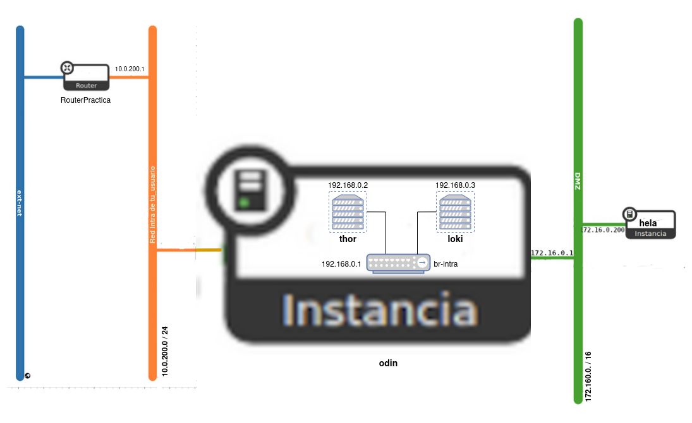
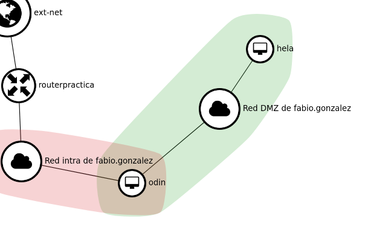

# Práctica OpenStack

En esta ocasión vamos a ver como configurar un escenario de OpenStack el cual vamos a usar durante todo el curso. Este escenario está compuesto de 4 máquinas: 2 instancias en OpenStack y dos contenedores LXC que se ejecutará en una de las instancias.

El dominio será un subdominio de `fabio.gonzalonazareno.org`. Finalmente tendremos:

* Máquina 1: Instancia en OpenStack con **Debian 12 Bookworm** que se llama `odin.fabio.gonzalonazareno.org`.
* Máquina 2: Instancia en OpenStack con **Rocky Linux 9** que se llama `hela.fabio.gonzalonazareno.org`.
* Máquina 3: Contenedor LXC con **Ubuntu 22.04** que se llama `thor.fabio.gonzalonazareno.org`.
* Máquina 4: Contenedor LXC con **Ubuntu 22.04** que se llama `loki.fabio.gonzalonazareno.org`.

## Escenario



## Creación de las máquinas en OpenStack

### 1. Crea un nuevo router llamado **RouterPractica** conectado a la red externa.

```bash
openstack router create routerpractica
```

```bash
openstack router set routerpractica --external-gateway ext-net
```

### 2. Crea una red interna que se llame **Red Intra de tu_usuario**, con las siguientes características:
- Está conectada al router que has creado en el punto anterior.
- Direccionamiento: 10.0.200.0/24
- Con DHCP y DNS (`172.22.0.1`).
- La puerta de enlace de los dispositivos conectados a esta red será el `10.0.200.1`.

```bash
openstack network create "Red intra de fabio.gonzalez"
```

```bash
openstack subnet create --network "Red intra de fabio.gonzalez" --subnet-range 10.0.200.0/24 --dns-nameserver 172.22.0.1 --dhcp 172.22.0.1
```
Para especificar mi subred he usado el ID, ya que esta no tiene nombre

```bash
openstack router add subnet routerpractica ac1ee726-ddfd-464d-a7b4-e24a69149042
```

### 3. Crea una red interna que se llame **Red DMZ de tu_usuario**, con las siguientes características:
- Direccionamiento: 172.16.0.0/16
- Con DHCP y DNS (`172.22.0.1`).
- La puerta de enlace de los dispositivos conectados a esta red será el `172.16.0.1`.

```bash
openstack network create "Red DMZ de fabio.gonzalez"
```

```bash
openstack subnet create --network "Red DMZ de fabio.gonzalez" --subnet-range 172.16.0.0/16 --dns-nameserver 172.22.0.1 --dhcp 172.22.0.1
```

### 4. Las dos instancias que vamos a crear se van a configurar con `cloud-init` de la siguiente manera:
- Deben actualizar los paquetes de la distribución de la instancia.
- El dominio utilizado será del tipo `tunombre.gonzalonazareno.org`. Por lo tanto en la configuración con `cloud-init` habrá que indicar el hostname y el FQDN.
- Se crearán dos usuarios:
- Un usuario sin privilegios. Se puede llamar como quieras
(pero el nombre será el mismo en todas las máquinas) y accederás a las
máquinas usando tu clave ssh privada.
- Un usuario `profesor`, que puede utilizar `sudo` sin contraseña. Copia de las claves públicas de todos los profesores en las instancias para que puedan acceder con el usuario `profesor`.
- Cambia la contraseña al usuario `root`.
### 5. Creación de la **máquina1 (odin)**:
- Crea una instancia sobre un volumen de 15Gb, usando una imagen de **Debian 12 Bookworm**. Elige el sabor `vol.medium`. Y configuralá con `cloud-init` como se ha indicado anteriormente.

```bash
openstack volume create --bootable --size 15 --image "Debian 12 Bookworm" odin
```

```bash
openstack server create --flavor vol.medium \
--volume odin \
--security-group default \
--key-name "Fabio Gonzalez del Valle" \
--network "Red intra de fabio.gonzalez" \
--user-data cloud-config.yaml \
odin
```

- Está instancia estará conectada a la red **Red Intra de tu_usuario**. Asigna a la instancia una IP flotante.

```bash
openstack floating ip create ext-net
```

```bash
openstack server add floating ip odin 172.22.201.66
```

### 6. Configuración de la **máquina1 (odin)**:
- Conecta la instancia a tu **Red DMZ**, asígnale la dirección `172.16.0.1` para que sea la puerta de enlace las máquinas conectadas a esta red (recuerda que deberás configurar la red de la instancia para que tome dicha configuración).

```bash
openstack server add network odin "Red DMZ de fabio.gonzalez"
```

```bash
openstack port create --network "Red DMZ de fabio.gonzalez" --fixed-ip ip-address=172.16.0.1 puerto-odin
```

```bash
openstack server add port odin puerto-odin
```

- Deshabilita la seguridad de los puertos en las dos interfaces de red para que funcione de manera adecuada el NAT.

```bash
openstack server remove security group odin default
```

```bash
openstack port set --disable-port-security puerto-odin
```

```bash
openstack port set --disable-port-security f01ff47d-90d0-49eb-9581-535ae67f69be
```

- Configura de forma permanente la regla SNAT para que las máquinas de la **Red DMZ** tengan acceso a internet.

```bash
sudo iptables -t nat -A POSTROUTING -s 172.16.0.0/16 -o ens3 -j MASQUERADE
```

Para hacer las reglas permanentes podemos meterlas en el fichero **interfaces**, pero en este caso no contamos con el, así que lo que haremos será descargar el paquete `iptables-persistent`. Si hemos creado la regla antes de la instalación del paquete, esta regla será guardada automáticamente.

### 7. Creación de la **máquina2 (hela)**:
- Está instancia se conectará a la **Red DMZ**. Usando un puerto asigna a esta máquina la dirección `172.16.0.200`.

```bash
 openstack port create --network "Red DMZ de fabio.gonzalez" --fixed-ip ip-address=172.16.0.200 hela
```

- Crea una instancia sobre un volumen de 15Gb, usando una imagen de **Rocky Linux 9**. Elige el sabor `vol.normal`. Y configúrala con `cloud-init` como se ha indicado anteriormente.

```bash
 openstack volume create --bootable --size 15 --image "Rocky Linux 9" hela
```

```bash
openstack server create --flavor vol.normal \
--volume hela \
--security-group default \
--key-name "Fabio Gonzalez del Valle" \
--network "Red DMZ de fabio.gonzalez" \
--port hela \
--user-data cloud-config-hela.yaml \
hela
```

- Deshabilita la seguridad de los puertos en la interfaz de red para que funcione de manera adecuada el NAT.

```bash
openstack server remove security group hela default
```

```bash
openstack port set --disable-port-security hela
```

- Comprueba que tiene acceso a internet. **Si no tiene acceso a internet, no se han actualizado los paquetes con cloud-init, hazlo posteriormente.**.

En este punto de la práctica, mi topología de red se encuentra de la siguiente manera:



## Instalación de los contenedores

En **maquina1** vamos a crear dos contenedores en un red interna, para ello:

1. Crea en **máquina1 (odin)** un linux bridge llamado `br-intra` (no lo hagas con `virsh` ya que se configura una reglas de cortafuego muy estrictas) y asigna una dirección IP estática `192.168.0.1`. Esta será la IP de **máquina1 (odin)** conectada a este switch virtual y será la puerta de enlace de los
contenedores. Tienes que tener en cuenta que la imagen de Debian 12
Bookworm de OpenStack tiene **netplan** para la
configuración de las redes, por lo tanto tienes que configurar el bridge usando el fichero de configuración de netplan, para ello te puede ser
útil esta [página](https://fabianlee.org/2022/09/20/kvm-creating-a-bridged-network-with-netplan-on-ubuntu-22-04/). No olvides poner la mtu a 1450 al crear el bridge.
2. Instala LXC y crea dos contenedores con la distribución **Ubuntu 22.04**. Estos contenedores serán la **máquina3 (thor)** y la **máquina4 (loki)**.
3. Configura de forma permanente la regla SNAT para que los contenedores tengan acceso a internet.
4. Conecta los contenedores al bridge `br-intra` y configúralo de forma estática con las siguientes direcciones: **máquina3 (thor)** la `192.168.0.2` y **máquina4 (loki)** la `192.168.0.3`. Su DNS será el `172.22.0.1`.
5. Para que la red de OpenStack funcione de forma adecuada las imágenes que usamos tienen configurado la mtu (*Unidad máxima de transferencia*) a 1450 bytes. Tenemos que adecuar los contenedores a este tamaño de
trama. Para ello introduce en la configuración de los contenedores la
línea: `lxc.net.0.mtu = 1450`.
6. Configura los contenedores para que se auto inicien al reiniciar la instancia.
7. Los contenedores tendrán características parecidas a las instancias anteriormente:
    - Debes actualizar los paquetes de la distribución instalada.
    - El dominio utilizado será del tipo `tunombre.gonzalonazareno.org`. Por lo tanto configura de manera adecuada el hostname y el FQDN.
    - Para acceder a los contenedores vamos a usar ssh.
    - Crea dos usuarios:
        - Un usuario sin privilegios. Se puede llamar como quieras
        (el nombre de usuario que usaste en las instancias) y accederás a los
        contenedores usando tu clave ssh privada.
        - Un usuario `profesor`, que puede utilizar `sudo` sin contraseña. Copia de las claves públicas de todos los profesores en los contenedores para que puedan acceder con el usuario `profesor`.
    - Cambia la contraseña al usuario `root`.
